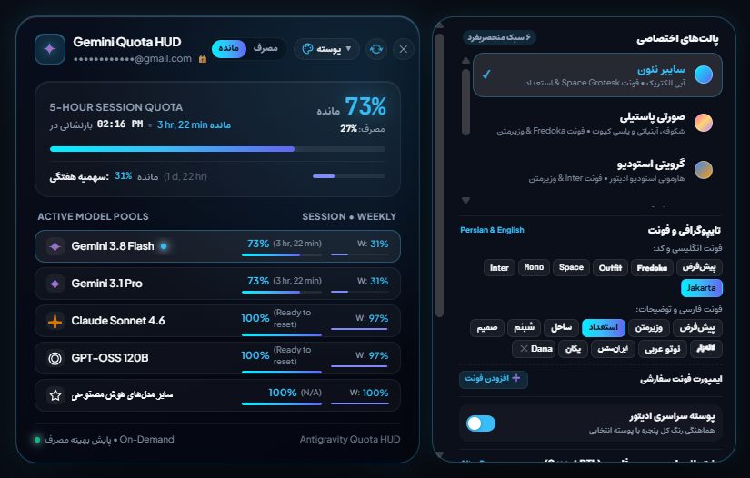

# Antigravity Quota Monitor & Smart RTL Suite ⚡️

[](https://opensource.org/licenses/MIT)
[]()
[]()
[]()
[]()

> The ultimate all-in-one companion for **Google Antigravity**: Real-time quota tracking HUD, luxury glassmorphic themes, dual typography engine, and full Persian/Arabic Smart RTL support.

<p align="center">
  
</p>

---

## 🌟 Core Pillars

### 1. ⚡️ Real-Time Quota HUD & Dual Tracking
- **Model Selector Micro-Badge:** Embeds a subtle, non-intrusive status capsule right inside the model picker (`• 74% | W: 44%`).
- **Dual Quota Tracking:**
  - **5-Hour Session Quota:** Real-time limit with live countdown timer (`Resets in 2 hr, 55 min`).
  - **Weekly Quota:** 7-day aggregate burn rate indicator (`W: 44%`).
- **Multi-Model Breakdown:** Live status cards for:
  - `Gemini 3.8 Flash High`
  - `Gemini 3.1 Pro`
  - `Claude Sonnet 4.6`
  - `GPT-OSS 120B`
- **Dynamic Toggle:** Instant toggle between remaining percentage (`مانده`) and used percentage (`مصرف`).

### 2. 🎨 Quantum Glassmorphism Themes
- **6 Handcrafted Visual Styles:**
  - 🌿 **Quantum Emerald (زمرد کوانتوم):** Cyber emerald green, deep cyber-night dark background.
  - ⚡️ **Cyberpunk Neon (سایبر نئون):** Electric cyan accent with Space Grotesk typography.
  - 🌌 **OLED Deep Dark (اولد دارک):** Pitch black `#000000` with high-contrast glowing accents.
  - 🌸 **Sweet Pastel (صورتی پاستیلی):** Soft cotton-candy pink, dreamy lavender, and marshmallow curves.
  - 🌅 **Sunset Glow (غروب بنفش):** Amber-magenta radiant gradient.
  - 💎 **Vision Glass (شیشه‌ای ویژن):** Ultra-blurred translucent glassmorphism.
- **UI-Wide Theming:** Harmonizes colors across chat text, thinking & reasoning blocks (`thinking`), LaTeX/KaTeX mathematical formulas, and inline code tags.

### 3. 🔤 Dual Typography & Custom Font Importer
- **10 Built-in Persian/Arabic Fonts:**
  - `وزیرمتن (Vazirmatn)`, `استعداد (Estedad)`, `ساحل (Sahel)`, `شبنم (Shabnam)`, `صمیم (Samim)`, `لاله‌زار (Lalezar)`, `نوتو عربی (Noto Sans Arabic)`, `ایران‌سنس (IRANSansX)`, `بی یکان (B Yekan)`.
- **Modern Latin Fonts:**
  - `Fredoka`, `Outfit`, `Space Grotesk`, `JetBrains Mono`, `Inter`, `Plus Jakarta Sans`.
- **Custom Font Importer:** Type the name of any local font installed in your OS (e.g. `Dana`, `IRANYekanX`, `Peyda`) or provide a direct webfont CSS link.

### 4. 🌍 Smart RTL & Persian Language Suite
- **Smart Auto-Direction:** Automatically detects Persian, Arabic, and Hebrew text paragraph-by-paragraph and aligns direction cleanly to `rtl`.
- **Force RTL Mode:** Single toggle to enforce RTL layout across all chat messages and prompt inputs.
- **Windows Persian `@` Key Fix:** Fixes the Persian keyboard layout so `Shift + 2` immediately inserts `@` (for referencing files/tools) instead of the Persian comma (`٬`).
- **Strict Code & Thinking Isolation:** Code blocks (`pre`, `code`), KaTeX formulas, and thinking processes are strictly isolated in LTR monospace.
- **RTL List Padding Fix:** Restores perfect indentation for ordered and unordered lists in RTL mode.
- **Typography Tuning:** Live sliders for **Line Height** (1.2 – 2.4) and **Font Size** (12px – 22px).
- **Instant Shortcut (`Alt + R`):** Toggle Smart RTL on/off anywhere with a single keystroke.

---

## 🚀 One-Line Installation

### Windows (PowerShell)
Open PowerShell and run:
```powershell
irm https://raw.githubusercontent.com/Madgod-xyz/antigravity-quota-monitor/main/install.ps1 | iex
```

### macOS & Linux (Bash)
Open your terminal and run:
```bash
curl -fsSL https://raw.githubusercontent.com/Madgod-xyz/antigravity-quota-monitor/main/install.sh | bash
```

### Manual Installation (All Platforms)
```bash
git clone https://github.com/Madgod-xyz/antigravity-quota-monitor.git
cd antigravity-quota-monitor

# On Windows:
.\install.ps1

# On macOS / Linux:
chmod +x install.sh
./install.sh
```

---

## ⌨️ Shortcuts & Controls

| Shortcut / Action | Description |
| :--- | :--- |
| `Alt + R` | Toggle Smart RTL On / Off |
| `Shift + 2` | Types `@` instead of `٬` on Persian keyboard layout |
| Click Floating Pill | Toggles the Quota HUD Popover & Theme Drawer |
| Drawer Settings | Switch themes, select fonts, import custom fonts & tune line height |

---

## 🛠 Architecture & How It Works

1. **Native Background Daemon (`sync_daemon.py`):**
   - Communicates with CloudCode endpoint (`https://daily-cloudcode-pa.googleapis.com/v1internal:fetchAvailableModels`).
   - Calculates 5-hour session reset windows and 7-day weekly burn rate.
   - Runs a lightweight on-demand HTTP server on `127.0.0.1:39281` for instant sub-second refresh.
   - Automatically connects to Antigravity's active Chrome DevTools Protocol (CDP) port.

2. **DOM Injector & Smart RTL Engine (`antigravity_quota_injector.js`):**
   - Injects the floating capsule pill, liquid glass HUD, and upward theme drawer.
   - Runs dynamic font fallback management (`LatinFont, PersianFont, sans-serif`).
   - Observes DOM mutations and user typing for instant, non-blocking RTL auto-alignment.
   - Persists all settings (theme, mode, active fonts, custom imported fonts, RTL toggles, sliders) in `localStorage`.

---

## 🇮🇷 راهنمای فارسی (Persian Overview)

این پروژه یک افزونه همه‌فن‌حریف و جامع برای محیط **Google Antigravity** است که تمام نیازهای بصری و کاربردی کاربران را به صورت یکپارچه برطرف می‌کند:

1. **پایش لحظه‌ای سهمیه و مدل‌ها:** نمایش دقیق درصد سهمیه دوره‌ای ۵ ساعته به همراه تایمر معکوس بازنشانی، سهمیه مصرفی هفتگی، و کارت‌های تفکیک‌شده مدل‌های هوش مصنوعی (Gemini 3.8 Flash High، Gemini 3.1 Pro، Claude Sonnet 4.6 و GPT-OSS 120B).
2. **پوسته‌های لوکس شیشه‌ای (Quantum Themes):** ۶ تم اختصاصی (زمرد کوانتومی، سایبرپانک نئون، اولد دارک، صورتی پاستیلی، غروب بنفش و شیشه‌ای ویژن) با هماهنگی کامل رنگ محیط، متون چت، فرمول‌های ریاضی و کادرهای استدلال (thinking).
3. **تایپوگرافی دوگانه و ایمپورت فونت دلخواه:** ۱۰ فونت پیش‌فرض فارسی (وزیرمتن، استعداد، ساحل، شبنم، صمیم، لاله‌زار، نوتو، ایران‌سنس و یکان) همراه با قابلیت افزودن هر فونت نصب‌شده روی ویندوز یا وب‌فونت دلخواه.
4. **موتور جامع راست‌چین هوشمند (Smart RTL):**
   - تشخیص هوشمند زبان و تراز خودکار پاراگراف‌ها به سمت راست.
   - اصلاح کلید `Shift + 2` برای تایپ نشان `@` در کیبورد فارسی به جای ویرگول.
   - کلید میانبر `Alt + R` برای خاموش/روشن کردن آنی راست‌چین.
   - اسلایدرهای تنظیم فاصله خطوط (Line Height) و اندازه قلم (Font Size).
   - ایزوله‌سازی کامل کدهای برنامه‌نویسی و کادرهای تفکر در حالت چپ‌به‌راست.

---

## 📄 License

MIT License © 2026 [Madgod-xyz](https://github.com/Madgod-xyz)
